# MixAssist

**A Reaper script suite for professional mix session preparation.**

MixAssist automates the most repetitive tasks at the start of a mixing session: track classification, folder creation, stereo grouping, drum bus setup, FX chains, quick balance and session export — all from a single floating window.

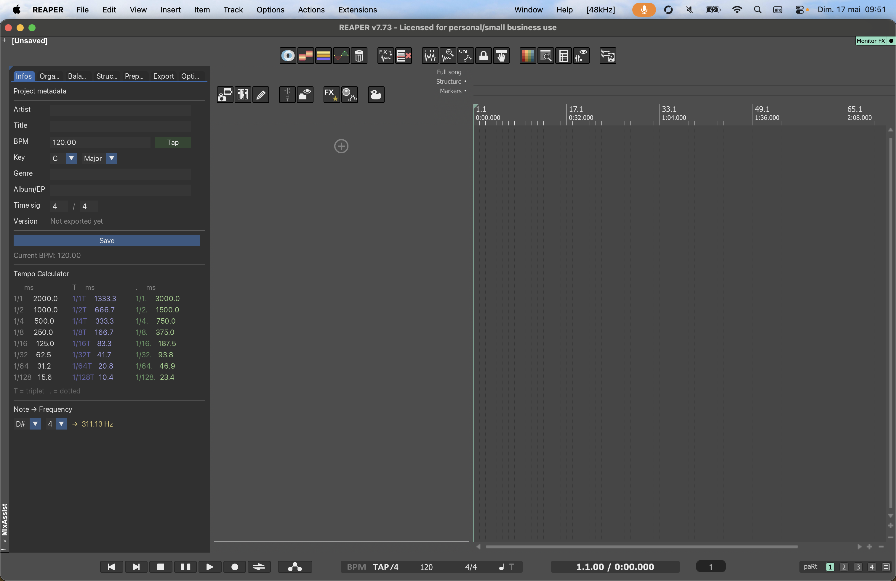

---

## Requirements

- **Reaper** 6.x or later
- **ReaImGui** (install via ReaPack)
- **SWS Extension** (recommended)

---

## Installation

1. Copy the `MixAssist` folder to your Reaper Scripts directory  
   (`~/.config/REAPER/Scripts/` on Linux/Mac, `%APPDATA%\REAPER\Scripts\` on Windows)
2. In Reaper: **Actions → Show action list → Load** → select `MixAssist.lua`
3. Assign a shortcut or add it to a toolbar
4. Launch MixAssist — a floating window will appear

---

## Overview

MixAssist is organized into **7 tabs**:

---

### ℹ️ Infos
Project information and session metadata.

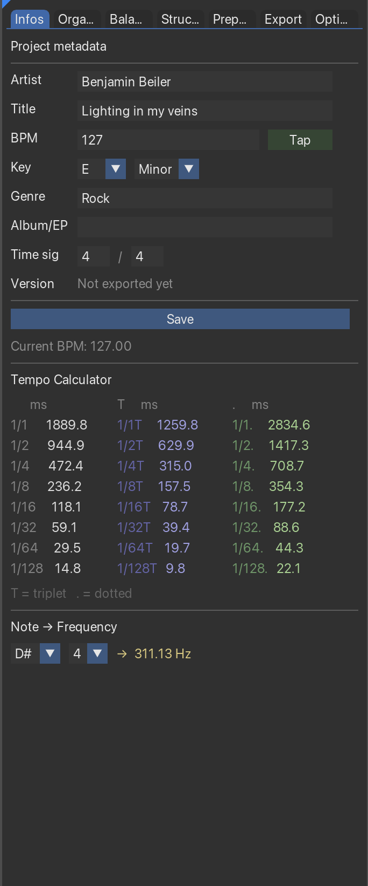

---

### 🗂 Organise
The core of MixAssist. Automatically classifies all tracks in the project into color-coded folders based on their names.

**Before / After:**

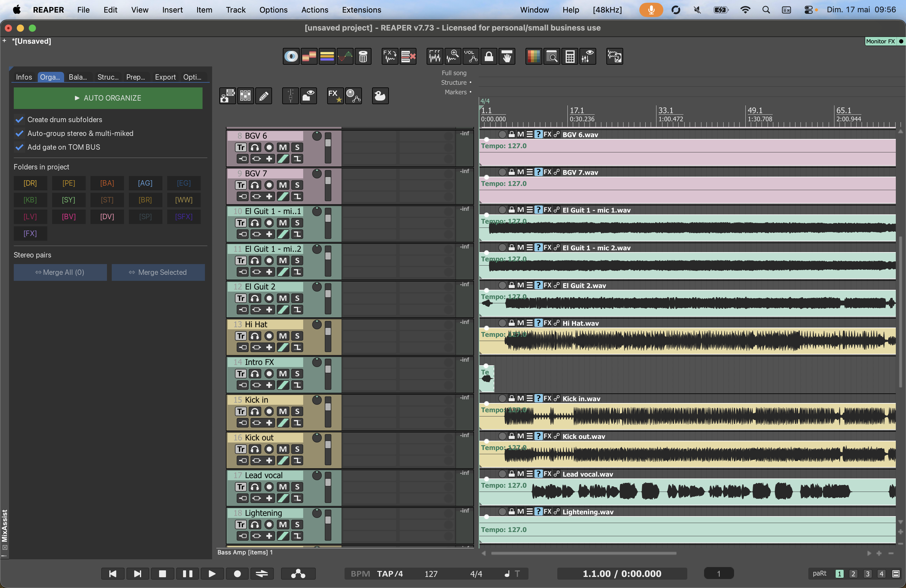
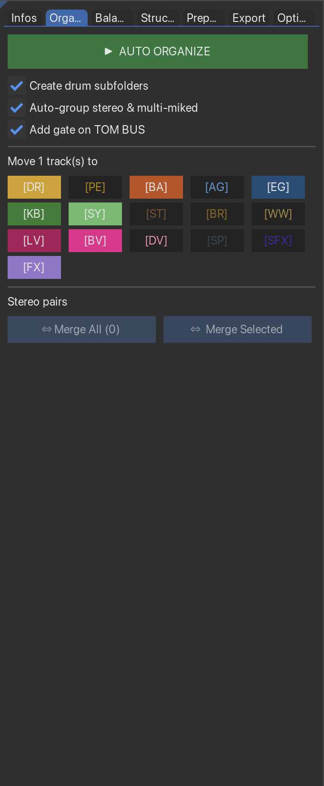

**Detected categories:**
- `[DR]` — Drums (kick, snare, toms, hats, overheads, rooms)
- `[PE]` — Percussion
- `[BA]` — Bass
- `[AG]` — Acoustic guitar
- `[EG]` — Electric guitar
- `[KB]` — Keys / Piano
- `[SY]` — Synth
- `[ST]` — Strings
- `[BR]` — Brass / Horns
- `[WW]` — Woodwinds
- `[LV]` — Lead vocals
- `[BV]` — Backing vocals
- `[DV]` — Double vocals
- `[FX]` — FX tracks
- `[SFX]` — Sound effects
- `[?]` — Unclassified (to be sorted manually)

**Options:**
- **Drum sub-buses** — automatically creates BD BUS, SD BUS, TOM BUS, OH BUS, ROOM BUS inside `[DR]`
- **Auto-group stereo & multi-mic** — detects L/R pairs and multi-mic tracks and groups them into sub-folders
- **Merge All** — merges all detected L/R pairs into stereo tracks
- **Merge Selected** — merges 2 selected tracks, or a selected folder containing exactly 2 L/R tracks

> Track classification is based on keyword detection in track names. See `Config.lua` to customize keywords.

---

### ⚡ Balance
One-click rough balance based on audio analysis.

Measures the average peak level of each track and adjusts fader volume to reach configurable target levels per category. Runs folder by folder with a real-time progress bar.

> **Note:** Quick Balance is designed to make an unbalanced session immediately listenable — not to replace a proper mix balance. Incoming sessions are often all over the place level-wise, and this gets things to a reasonable starting point fast.

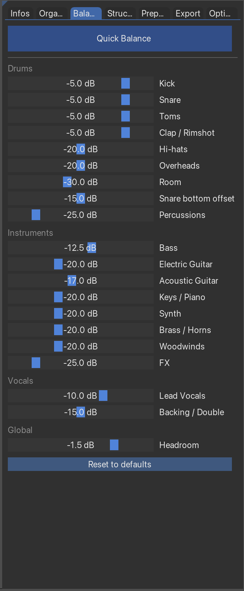
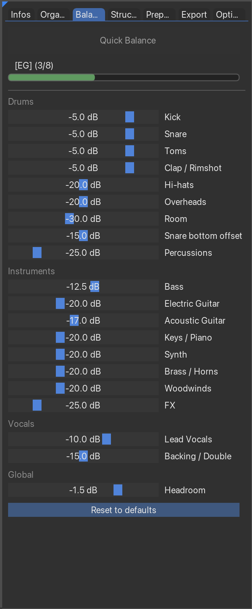
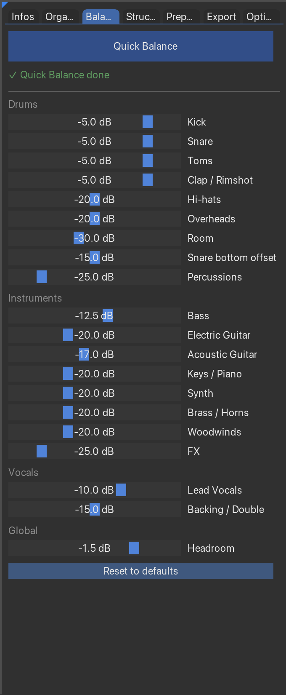

**Configurable targets** (directly in the Balance tab):  
Kick, Snare, Toms, Hi-hats, Overheads, Room, Bass, Electric/Acoustic Guitar, Keys, Synth, Brass, Woodwinds, FX, Lead/Backing Vocals, and global headroom.

> Quick Balance reads audio from disk (offline analysis) — no playback required.

---

### 🎼 Structure
Creates arrangement markers (Intro, Verse, Pre-Chorus, Chorus, Bridge, Outro...) for fast session navigation.

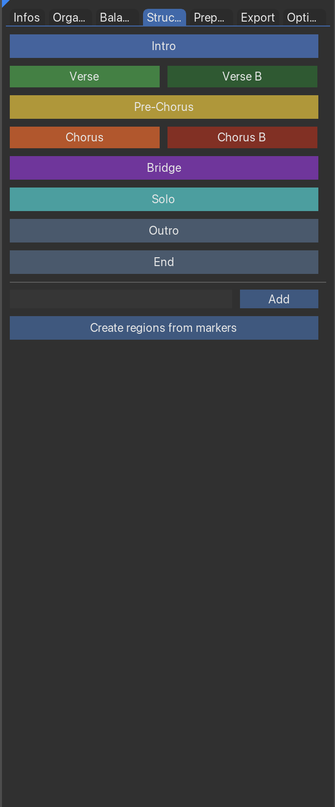

---

### 🎛 Prepare
Two distinct workflows in one tab:

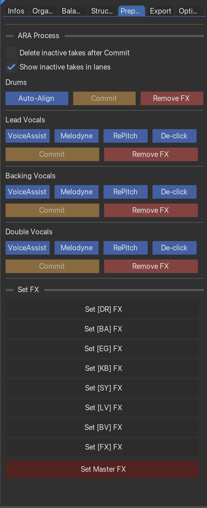

**ARA Process** — for item-level plugins:
- Add **[VoiceAssist](https://noiseworks.com)** (NoiseWorks), **[Melodyne](https://www.celemony.com)** (Celemony), or **[RePitch](https://www.synchroarts.com)** (Synchro Arts) to all items in a vocal folder
- Add **[RX De-click](https://www.izotope.com)** (iZotope) to items
- **Commit** — renders items to new takes (with option to delete inactive takes)
- **Remove FX** — removes all item FX
- Works on Lead Vocals, Backing Vocals, and Double Vocals folders
- **[Auto-Align 2](https://www.soundradix.com)** (Sound Radix) support for Drums

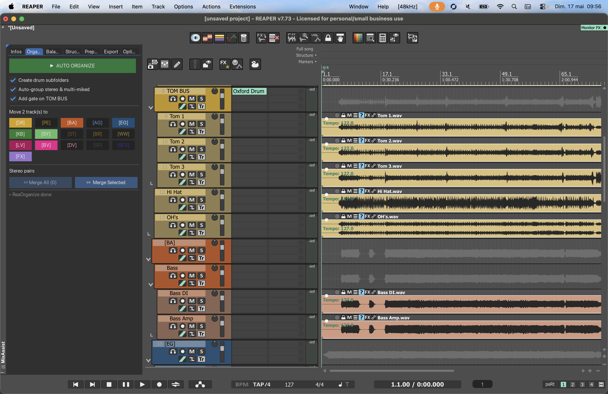
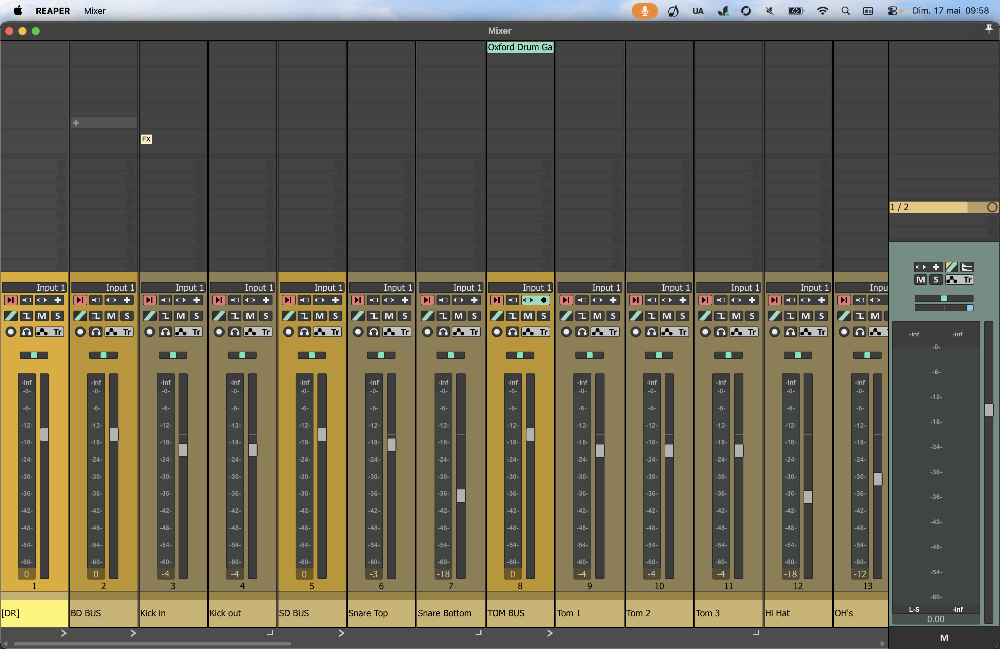

**Set FX** — for track-level setup:
- Dynamically displays one button per folder detected in the project **and** configured in FXConfig
- Applies FX chains, creates parallel tracks, sets up sends, triggers (BD/SD), and grouping
- Buttons are sorted by track position in the project
- **Set Master FX** — applies FX chain to the master track

---

### 📤 Export
Handles mix version management and delivery exports.

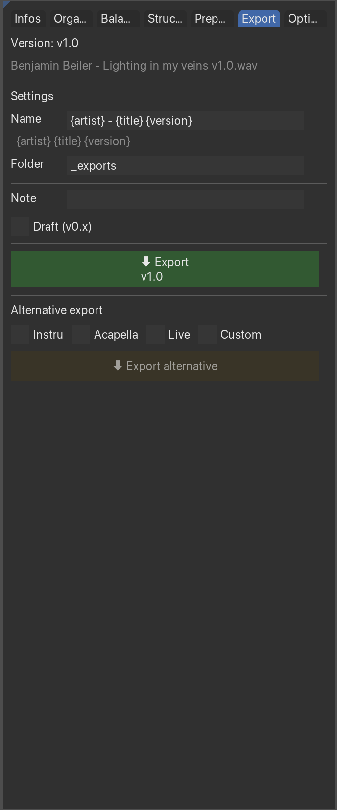

- Version numbering with semantic versioning (v1.0, v1.1, v2.0...)
- Simultaneous WAV + MP3 export
- Custom suffix and alternate labels
- Configurable export paths and formats

---

### ⚙️ Options

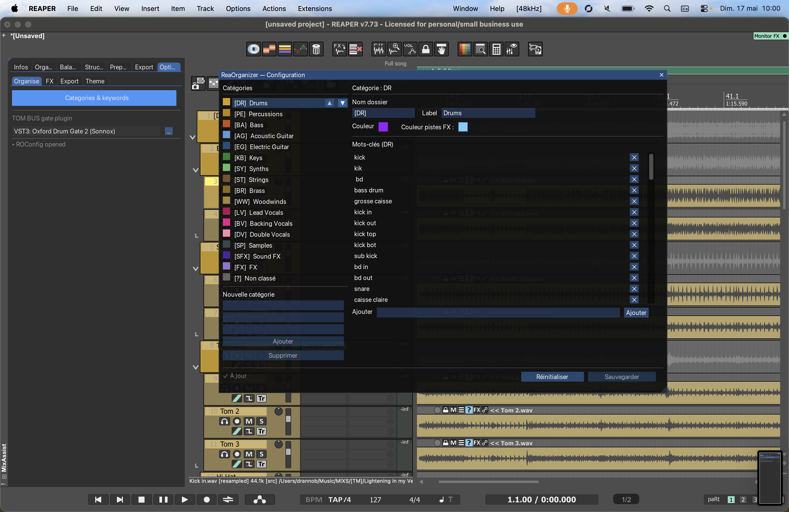
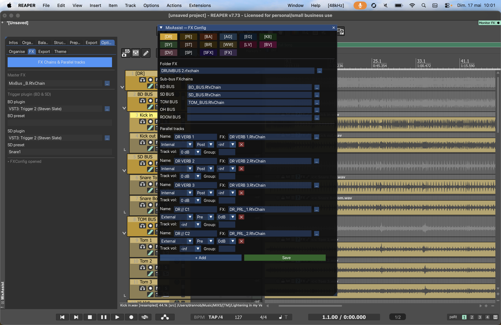
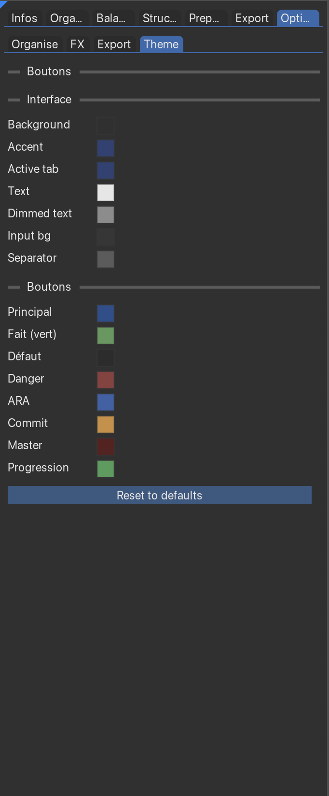

- **Organise** — folder names, colors, keyword lists
- **FX** — master FX chain, drum trigger plugins, TOM gate plugin
- **Theme** — full color customization (background, accent, all button types, progress bar)

---

## FX Configuration (FXConfig)

The **FX Config** tab (accessible from the Prepare tab) lets you configure per-folder FX setups:

- **Folder FX chain** — applied to the folder bus track
- **Sub-bus FX chains** — per sub-bus (BD BUS, SD BUS, etc.)
- **Parallel tracks** — create internal or external parallel tracks with:
  - Name, FX chain, position (internal/external), pre/post fader, send volume, track volume, group number

Configurations are saved in `FXConfig.lua` and persist between sessions.

---

## Track Naming Conventions

MixAssist detects tracks by keywords in their names. Some examples:

| Category | Keywords detected |
|----------|------------------|
| Kick | `kick`, `bd`, `bass drum` |
| Snare | `snare`, `sd` |
| Overheads | `overhead`, `oh` |
| Room | `room`, `ambiance`, `amb` |
| Bass | `bass`, `di` |
| Lead vocal | `lead`, `vox`, `vocal` |

> Full keyword lists are in `Config.lua` and can be customized.

---

## Known Limitations

- Track classification relies on keyword matching — unusual track names may land in `[?]`
- Quick Balance requires audio files on disk (rendered items only)
- ARA plugins must be installed separately
- FX chains and presets must be configured manually in FXConfig before use

---

## Credits

**Concept, design & development:** Gaëtan Bonnard  
**Development assistance:** Claude (Anthropic)

---

## License

MixAssist is licensed under the **GNU General Public License v3.0**.

You are free to use, study and modify this software. If you redistribute it or a modified version, you must do so under the same GPL v3 license and **you may not sell it or include it in a commercial product**.

© 2025 Gaëtan Bonnard — See [LICENSE](LICENSE) for full terms.

---

*MixAssist is a personal tool shared with the community. Feedback and bug reports are welcome.*
